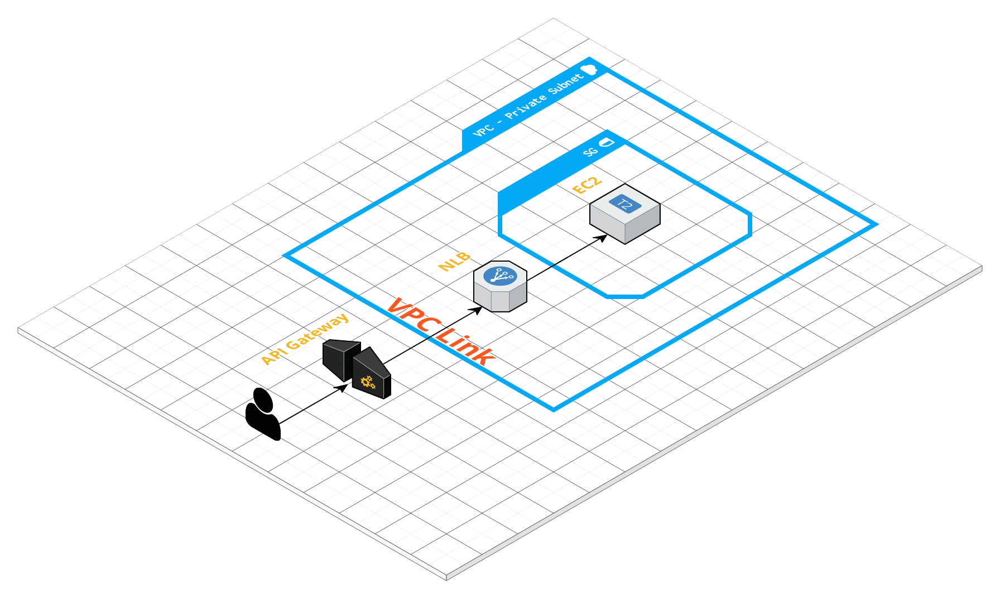

# API Gateway private integration

[](https://www.terraform.io/downloads.html)

How can we access API routes hosted in a private subnet?

This project is a POC of API Gateway private integration: <https://docs.aws.amazon.com/apigateway/latest/developerguide/set-up-private-integration.html>

## Workflow

1. Create a VPC with public and private subnets

2. Create an EC2 instance and put it in the private subnet

3. Deploy a sample node API (<https://github.com/zowe/sample-node-api>) on the EC2 instance thanks to user data

4. Create a Network Load Balancer with the instance in the target group

5. Connect VPC Link to the NLB

6. Create the API Gateway with a private integration

7. Bonus: add a proxy integration (<https://docs.aws.amazon.com/apigateway/latest/developerguide/api-gateway-set-up-simple-proxy.html>)

## Usage

### Install Terraform

To install Terraform, you can use [tfenv](https://github.com/tfutils/tfenv):

```bash
git clone https://github.com/tfutils/tfenv.git ~/.tfenv
ln -s ~/.tfenv/bin/* /usr/local/bin
tfenv install
tfenv use
```

### Apply Terraform

```bash
make apply
```

### Call API

Get the *api_invoke_url* Terraform output in the console.

Then you can invoke the resource **accounts** of the sample node API through this URL.

## Architecture diagram



## Minimal budget


